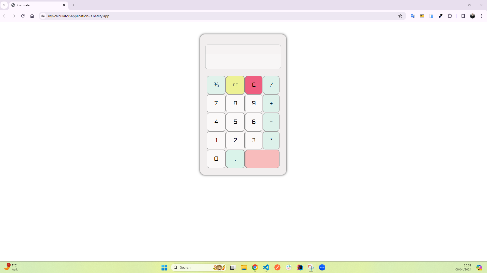
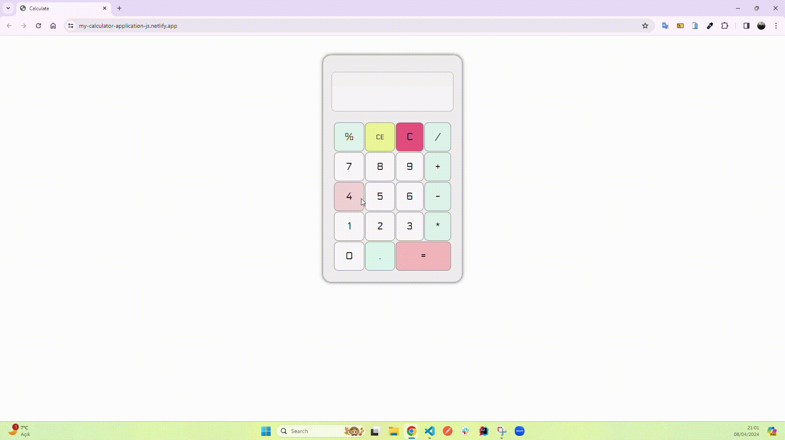

<h1>My Calculator Application</h1>

You can easily perform math operations with this fully functional calculator application that I developed using HTML5, CSS3, and JavaScript. Besides basic math operations such as addition, subtraction, multiplication, division, and percentage, it also has useful functions such as deleting incorrectly entered numbers and resetting the entire operation. It is a tool that will help you in your daily life with its easy use and stylish design.

<h2> The following technologies were used in the frontend development phase of my site: </h2>

- HTML5
- CSS3
- Javascript

<h2> Visit My Calculator App: </h2>

- https://my-calculator-application-js.netlify.app/

<h4>IMAGE</h4>

<h4>GIF</h4>

